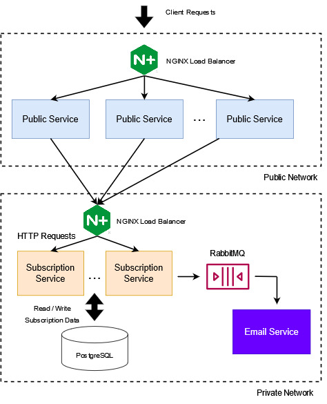
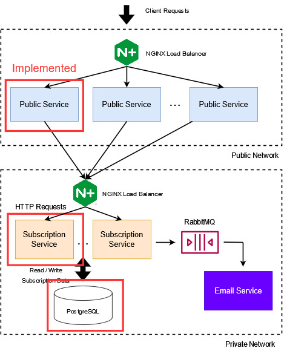

# Adidas Coding Challenge - NodeJS Back-End

*Author: Tsung-Yao Hsu*  
*Submission: 2023/3/16*  
*Email: ayao780607@gmail.com*  

### Design



The public service and subscription service will be implemented with **NodeJS** and **Express** for RESTful APIs. When receiving client requests, public service sends HTTP requests to subscription service to access / modify subscriptions. 

To achieve high availability and scalability, we can spin off multiple instances of each service independently since they are all stateless. I plan to use a NGINX load balancer to distribute the load (with least connections method) and monitor the health of instances.

Each instance will be running inside a Docker container. The private network is under a user-defined bridge network and does not expose port on the host.  

The subscription information will be persisted in a **PostgreSQL** database. I chose to store this in relational fashion since subscription is a structural dataset with same properties.

For each new subscription, a message will be pushed by the subscription service to a **RabbitMQ** broker, which will send the message to a queue consumed by an email service. With a looser requirement of 85% uptime (allowing 4 days downtime per month), the messages can be made non-persistent so the publisher does not need to wait for the publish confirms, to achieve better throughput.  

### SLA Response Time Calculation

For subscription service, it needs to recieve the request message, access the database, and send back the response. 

**Transmission delay** for sending / receiving a request message:

(500 Bytes (HTTP header) + 500 Bytes (request body)) * 8 (bits per byte) / 1 Gbps (server network bandwidth) = 8 microseconds

**Process delay** is mostly main memory referencing so it should be on 100-nanosecond level.

For **databases access time**, it takes about 10 milliseconds to load one page of 8KB generally.

From the above calculation, we can see the response time should be on the 10 millisecond level, which complies with our SLA theoretically. 

Of course, further performance testing is still required once the system is done.

### Implementation



At this time, only the public service, the subscription service, and the database are implemented.

Workflows:
1. Create New Subscriptions - Implemented  
2. Cancel Existing Subscriptions - Not Implemented  
3. Get Details of a Subscription - Not Implemented  
4. Get All Subscriptions - Not Implemented  

### Run The Application

```
docker compose up -d --build
```

To send a subscription request:
```
POST http://localhost:49160/subscribe
Body
{
    "firstName": "David",
    "lastName": "Jackson",
    "email": "abc@123.com"
}
```

### Testing

I attempted to implement a [unit test](tests/public_server.test.js) with Jest in public service but I could not resolve an issue so I left it commented. But please feel free to take a look.   
Potentially, an end-to-end test could also be added for creating new subscription. A sample request can be sent to the public service and the subscription record in db can be compared with the expected.

### High Level CI/CD Proposal

Code change & pull request created by engineers   
-> Build triggered by Jenkins  
-> Run unit tests and integration tests by Jenkins  
-> Code reviewed and merged by engineers  
-> Create a release tag by engineers  
-> Build the version by Jenkins  
-> Deployed to production by Jenkins  